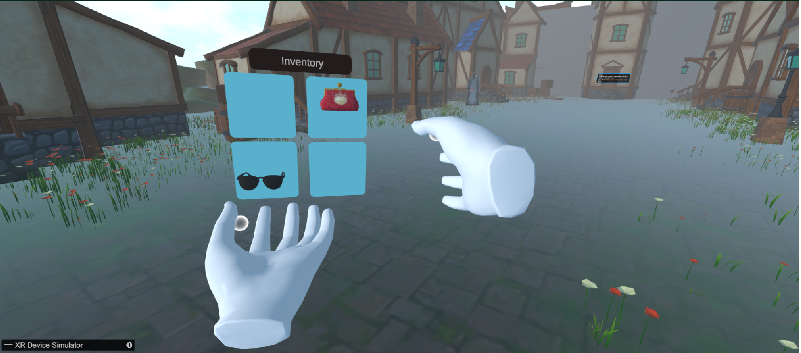
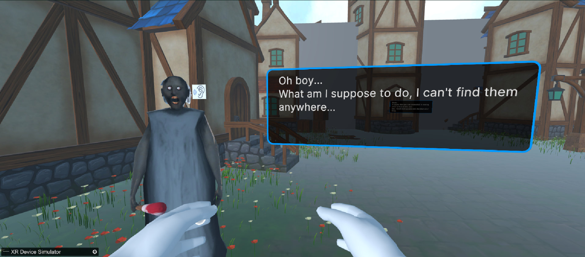
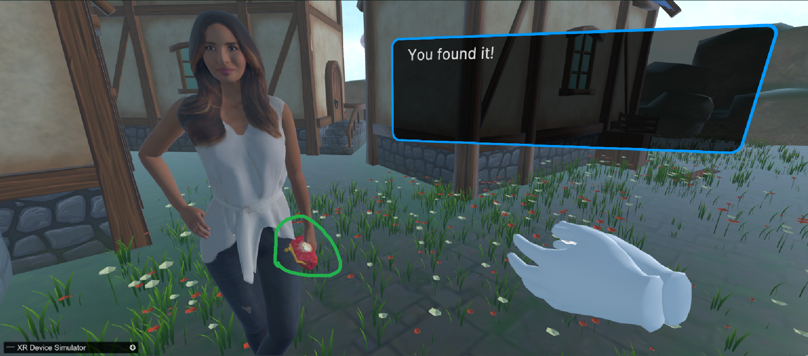

Hey Team 👋
Make sure to follow the controlling instructions cuz there isnt much UI to help you navigate the game yet.

## Table of Contents

- [Overview](#overview)
- [Installation](#installation)
- [Getting Started](#getting-started)
- [Controls](#controls)
- [Gameplay](#gameplay)
- [Features](#features)
  - [Speech Recognition](#speech-recognition)
  - [Quest System](#quest-system)
  - [Inventory System](#inventory-system)
  - [NPC Dialogue](#npc-dialogue)
  - [XR Interaction](#xr-interaction)
  - [Input System](#input-system)
- [Architecture & SOLID Principles](#architecture--solid-principles)
- [Troubleshooting](#troubleshooting)
- [Credits](#credits)

## Overview

You'll be interacting with NPCs through natural speech, and they will be responding to you accordingly using an AI Gemini powered system. Find the items that they ask of you and return it to them to see what is hidden behind "The Great Wall of America".

## Installation

### Requirements

- Unity 2021.3 or newer
- VR Headset (Meta Quest, Valve Index, HTC Vive, etc.)
- Microphone

### Setup Instructions

1. Clone or download this repository
2. Open the project in Unity
3. Make sure you have all required packages installed (they should just be included with the cloning the Repo):
   - XR Interaction Toolkit (version 2.4.3+)
   - Whisper Speech-to-Text package
   - Speech to Text Showcase asset
4. Connect your VR headset
5. Press Play in Unity

## Controls

### Basic Controls

- **Move**: Use the left thumbstick/joystick
- **Turn**: Use the right thumbstick/joystick (snap turning)
- **Grab Objects**: Grip button on controllers
- **Open Inventory**: Simply have the pawm of your hand face upwards
- **Put Item In Inventory**: While holding the item, open your Inventory, and let go of the item in out of the inventory slots
- **Speech with NPCs**: Hold Secondary Button (B/Y) on your controller while near an NPC, then speak into your microphone, when done speaking, let go of the Button
- **UI Interaction**: Primary Button (A/X) to go to the next line of dialogue when talking to an NPC

## Gameplay

### Talking to NPCs

1. Approach an NPC (you'll see a dialog panel when close enough)
2. Press and hold the Secondary Button (B/Y) on your controller
3. Speak naturally into your microphone - the microphone icon will show when active to signify hearing you properly
4. Release the button when finished speaking
5. The NPC will process your speech and respond appropriately
6. Continue the conversation if you want

The speech recognition system will understand natural language, so you can phrase your questions and responses in however way you want!

### Completing Quests

1. Talk to NPCs to receive quests (they'll tell you what they need)
2. Listen carefully to their requests - quests are tracked automatically
3. Explore to find the required items
4. Collect items by grabbing them with your controller's grip button
5. Put the Items in your inventory by making the pawm of your hand face up
6. With the item in your inventory, return to NPCs with completed objectives
7. Watch the NPC as the item they requested becomes on their model

Completing all quests will destroy "The Great Wall of America" and reveal the game's conclusion, what is behind the wall.

### Inventory Management

1. Grab items by using the grip button when your hand is near them
2. Items are automatically stored in your inventory when grabbed
3. You can grab the item again from the inventory.

## Features

### Speech Recognition

The game uses Whisper speech-to-text technology to enable natural conversations with NPCs. This system:

- Processes your speech in real-time, and locally
- Converts speech to text for NPC interactions
- Provides visual feedback when listening via a microphone icon
- Uses voice activity detection (VAD) to filter out background noise
- Processes contextual understanding to remember what you said and to make conversations feel natural

### Quest System

The dynamic quest system features:

- Multiple NPCs with unique quests and personalities
- Contextual quest tracking that remembers your progress
- Quests that require specific items to be collected and delivered
- Automatic quest activation when speaking with NPCs
- A final objective that unlocks when all other quests are completed (Destroying The Great Wall of America)

The quest system drives the game's progression and encourages exploration of the environment to find all required items.

### Inventory System

The socket-based inventory system provides:

- Integration with the quest system for item tracking
- Intuitive object grabbing and manipulation
- Dedicated inventory slots for storing collected items
- Visual feedback when items are selected or stored

### NPC Dialogue

The dialogue system offers:

- Natural language processing for realistic conversations
- Contextual responses based on your quest progress
- NPCs that remember previous interactions
- Visual feedback during conversations through UI elements
- Character-specific dialogue styles and personalities
- Seamless integration with the Whisper speech recognition system
- Automatic quest updates based on conversation content

NPCs respond differently depending on your progress in the game, creating a dynamic narrative experience.

### XR Interaction

The XR interaction system provides:

- Intuitive grabbing and manipulation of objects
- Physical interactions with all items in the environment
- Haptic feedback for more immersive interactions
- Teleportation and smooth locomotion options
- UI interaction through pointing and selection
- Object highlighting when interactive elements are nearby
- Socket interactions for inventory and quest completion

Based on Unity's XR Interaction Toolkit, the system makes interacting with the virtual world feel natural and responsive.

### Input System

The game uses Unity's new Input System with complete controller mapping:

- Support for all major VR controllers
- Adaptive bindings that work across different devices
- Debug tools for testing button inputs
- Integration with XR Interaction Toolkit

## Architecture & SOLID Principles

The project architecture follows SOLID principles to ensure scalability, maintainability, and extensibility:

### Single Responsibility Principle (SRP)

- Each script has a focused purpose with clear responsibilities
- NPCInteractionController handles only NPC interactions
- QuestCompletionManager focuses solely on quest completion logic
- InventoryService and ItemSocketInteractor handle separate parts of the inventory system
- Core systems separated from game-specific implementation

### Open/Closed Principle (OCP)

- Core systems are designed to be extended without modification
- New quest types can be added without changing existing quest logic
- Input system allows adding new controller bindings without disrupting existing ones
- Services can be extended through implementation of interfaces

### Liskov Substitution Principle (LSP)

- Extensive use of interfaces allows for different implementations
- IQuestService, IDialogueProvider, IInventoryService interfaces
- Service implementations can be swapped without breaking dependent systems
- Components follow consistent interface contracts

### Interface Segregation Principle (ISP)

- Interfaces are focused and minimal
- Separate interfaces for different responsibilities:
  - IQuestCompletionTracker for tracking quest progress
  - IAudioService for sound effects
  - ILoggingService for debugging
  - IActiveConversationManager for managing NPC conversations
- No interface forces implementations to provide unnecessary functionality

### Dependency Inversion Principle (DIP)

- High-level modules depend on abstractions, not concrete implementations
- ServiceLocator pattern used to inject dependencies
- Systems request interfaces rather than specific implementations
- Components communicate through abstraction layers

### Additional Architectural Features

- Component-based design aligns with Unity's architecture
- Observer pattern used for event handling (OnQuestCompleted, OnDialogueCompleted)
- Factory pattern for creating dialogue responses
- Strategy pattern applied to different interaction behaviors
- Clear separation between UI, logic, and data layers

This architecture allows the game to be easily extended with new features, quests, and interactions while maintaining code quality and preventing tight coupling between systems.

## Troubleshooting

### Microphone Not Working

- Check that you're holding the Secondary Button (B/Y) while speaking
- Ensure your microphone is properly connected and enabled
- Check microphone permissions in your operating system
- Verify the correct microphone is selected in Unity's audio settings
- Try speaking louder or in a quieter environment
- Restart the game if speech recognition becomes unresponsive
